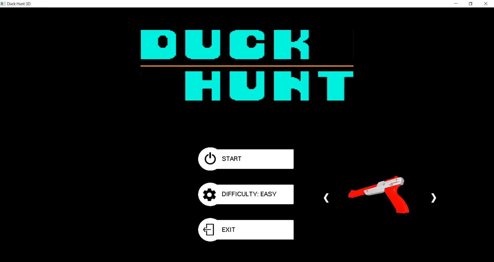
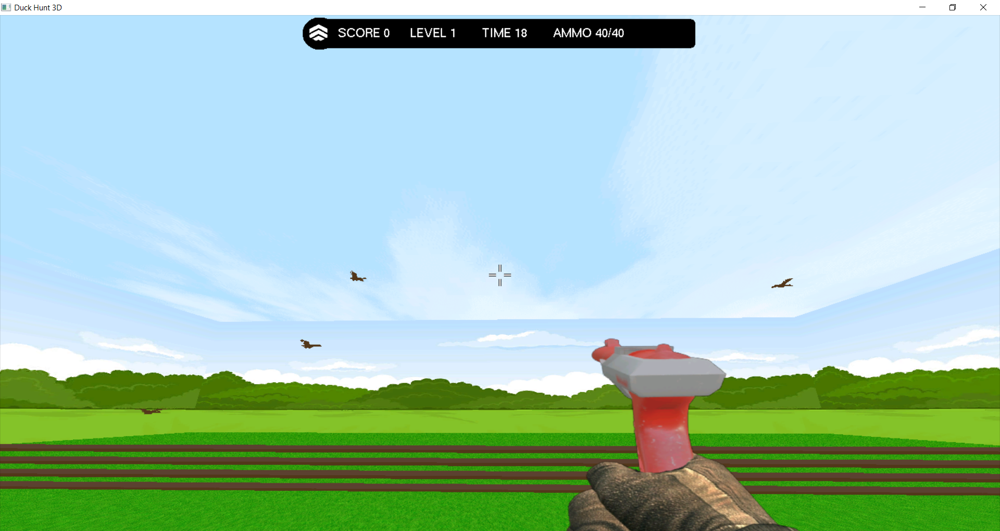
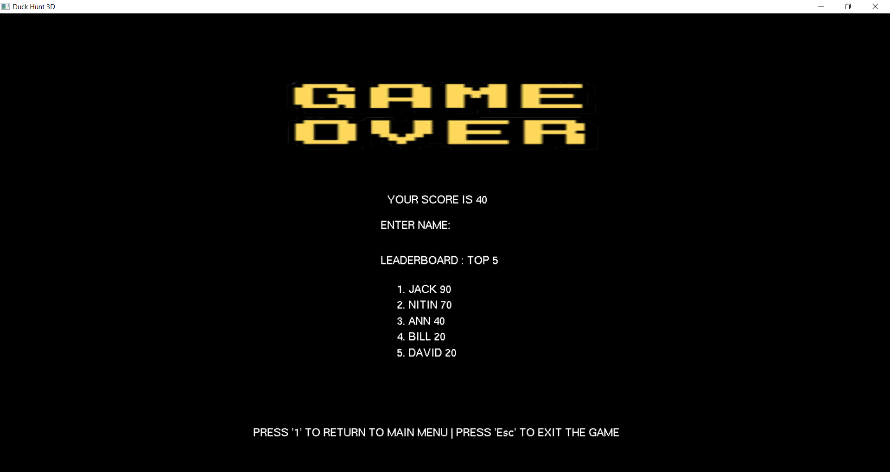

# Duck Hunt 3D

<br />
<p align="center">
  <h3 align="center">Overview</h3>

  <p align="justify">The aim of the project is to create a 3D version of Duck Hunt using OpenGL. Duck Hunt is an arcade shooter game on NES (Nintendo Entertainment System).
  <br />
</p>

<h5 align="center">Screenshots</h5>

<p align="center">
    
    <br>
    
    <br>
    
    <br>
</p>

<!-- TABLE OF CONTENTS -->
<details open="open">
  <summary><h2 style="display: inline-block">Table of Contents</h2></summary>
  <ol>
    <li>
      <a href="#about-the-project">About The Project</a>
      <ul>
        <li><a href="#Libraries">Libraries</a></li>
      </ul>
    </li>
    <li>
      <a href="#getting-started">Getting Started</a>
      <ul>
        <li><a href="#code-structure">Code structure</a></li>
      </ul>
    </li>
  </ol>
</details>


<!-- ABOUT THE PROJECT -->
## About The Project

<p align="justify">
Duck Hunt 3D is an OpenGL and GLUT based videogame where the player, in order to win the game, has to shoot all the ducks. The project is basically composed by three scenes: the main menu, the game and the scoreboard.
The goal of the game is to eliminate all targets in a set time interval with a certain number of bullets available; the speed of the ducks and the amount of bullets available are dependent on the selected difficulty.
</p>

### Libraries

* [GLEW] - OpenGL Extension Wrangler Library (GLEW) for header files and exceptions.
* [FreeGLUT] - OpenGL Context creation and user input handling.
* [irrKlang] - Sound engine to handle audio file formats for C++.
* [SOIL] - Simple OpenGL Image Library (SOIL) to load textures in OpenGL.

<!-- GETTING STARTED -->
## Getting Started

Instructions for code and installation are given below.


<!-- CODE STRUCTURE -->
### Code structure

```
src
├── main.cpp
│   ──> contains the window creation, the callbacks and the drawing routine
├── GameAssets.cpp
│   ──> contains the class for the texture loading
├── GenericModel.h
│   ──> contains the 3D model class that is extended by Bullet, Target etc...
| ...
```

<!-- Installation and usage -->
### Installation and usage
The project has been developed by using Visual Studio Code 2019. The VSC files are missing, so you need to create a blank project and build it using the source code.
